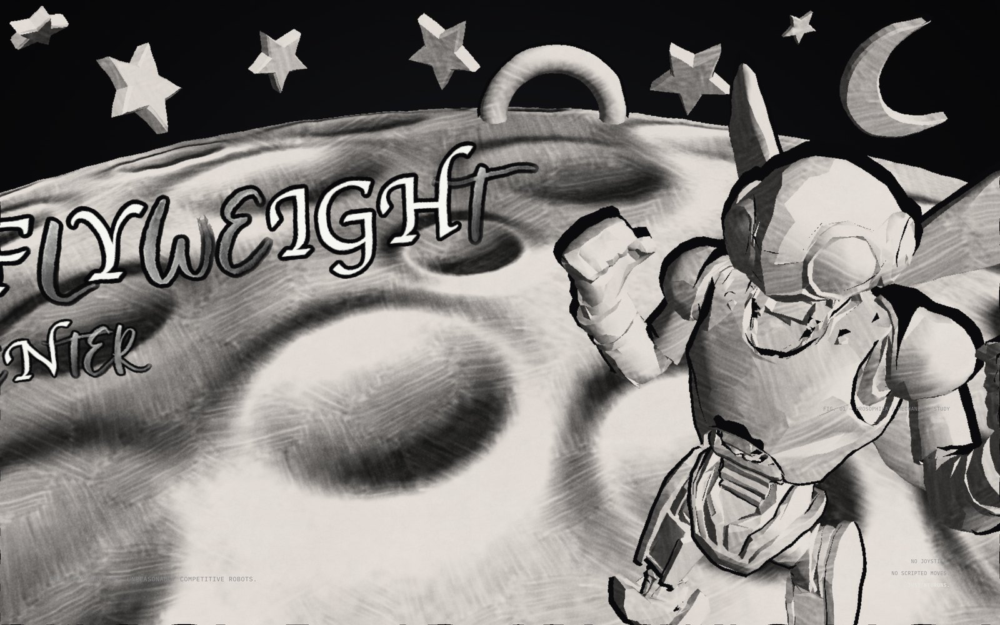
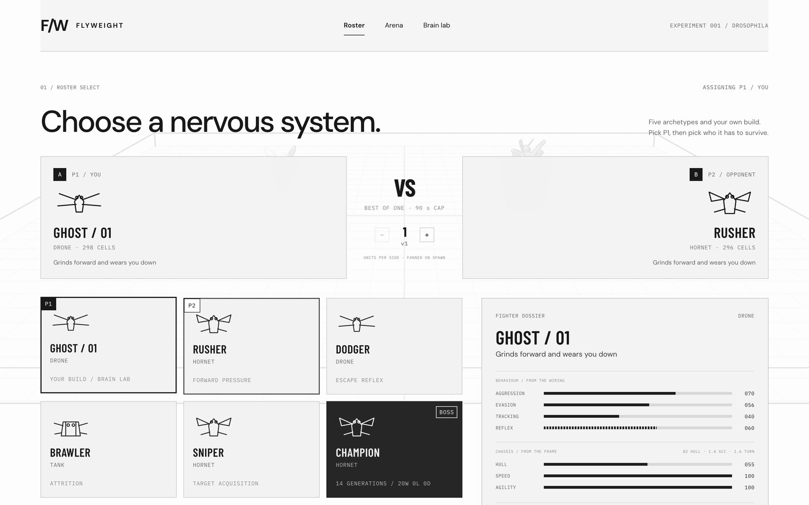
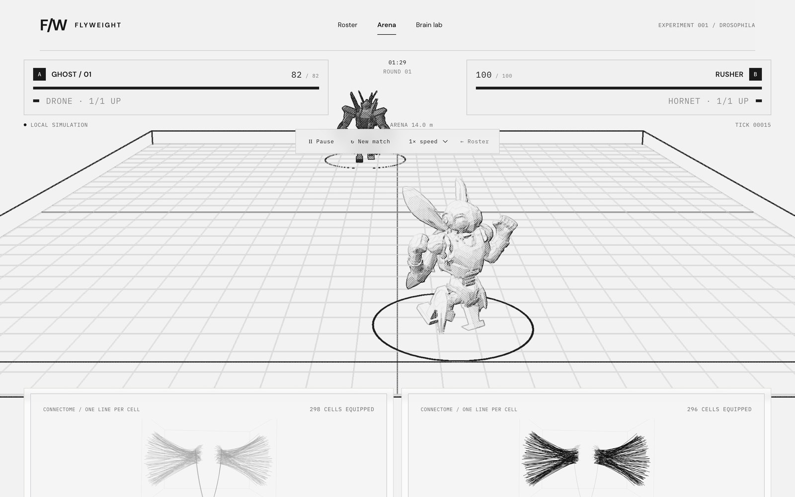
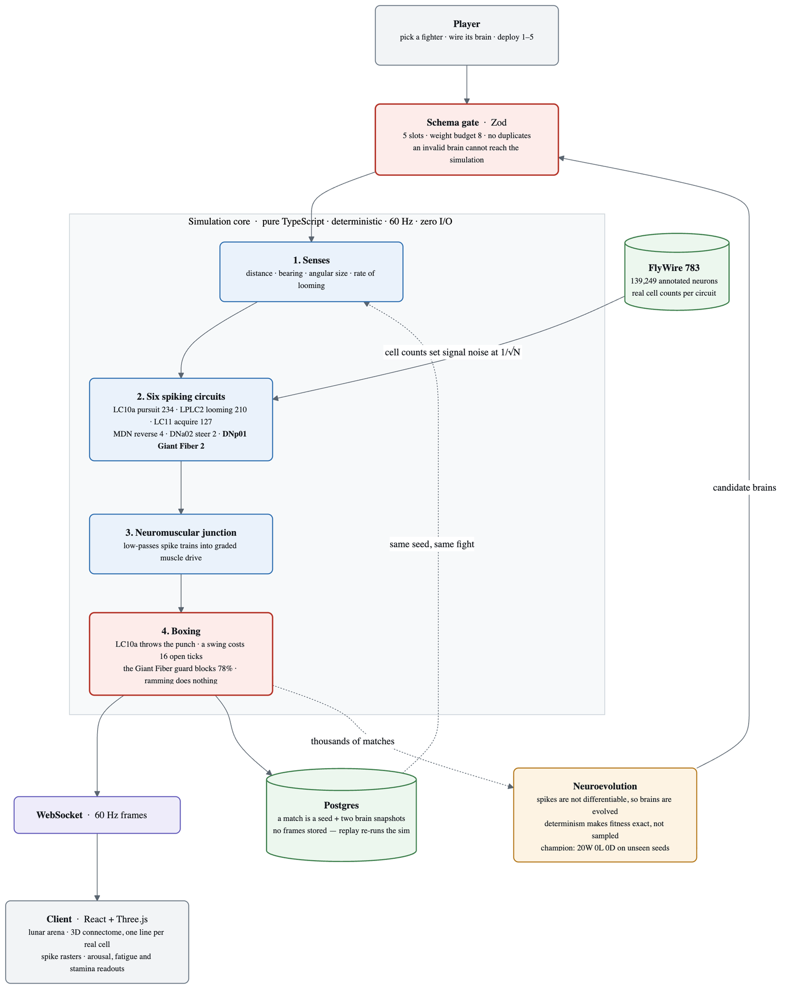

<h1 align="center">FLYWEIGHT</h1>
<p align="center"><b>Small brain. Big fight.</b></p>
<p align="center">Robot flies box each other on a moon, and their brains are real fruit fly circuits.</p>

<p align="center">
  
</p>

---

You never touch the controls.

You build a robot fly, wire its nervous system out of circuits taken from the *Drosophila*
connectome, deploy up to five of them onto a lunar ring, and find out whether your instincts
were any good. It flinches because its Giant Fiber fired. It chases because its
courtship-pursuit circuit did. Nothing is scripted.

<p align="center">
  
  <br><sub>Every stat on the card is computed from the brain you wired — they are the same numbers that drive the fight.</sub>
</p>

## The neurons are real

Cell populations are counted from the [FlyWire](https://flywire.ai) 783 public release
(Schlegel et al., *Nature* 2024) — 139,249 annotated neurons.

| Module | Circuit | Cells | Transmitter | In a fight |
|---|---|--:|---|---|
| `LPLC2 → DNp01` | looming into the Giant Fiber escape reflex | **2** | glutamate | runs at range, blocks up close |
| `LC10a` | small-target visual pursuit (courtship tracking) | 234 | acetylcholine | chases, and throws the punch |
| `LC11` | small-object detection | 127 | acetylcholine | acquires a target |
| `DNa02` | descending steering neuron | 2 | acetylcholine | turns |
| `MDN` | moonwalker descending neuron | 4 | acetylcholine | backs off, holds spacing |
| `P1` | arousal state | ~60 | acetylcholine | amplifies everything |

The shape of that table is the point. Hundreds of visual neurons converge onto **two**
descending cells, and the Giant Fiber is the only glutamatergic one in the set.

That asymmetry is in the simulation: population size sets signal noise at `1/√N`, so the
two-cell Giant Fiber is visibly twitchy while 234-cell pursuit is smooth. It is also in the
3D brain view, which draws **one line per real cell** — when escape fires you see two
threads flash; when pursuit fires, hundreds shimmer.

Synaptic weights between modules are **not** from the connectome. Those are your loadout.
That is the game.

<p align="center">
  
  <br><sub>Both brains are live. Populations light as they spike, with arousal, Giant Fiber fatigue and stamina beside them.</sub>
</p>

## They box

Damage comes from swung fists, never from ramming. Bodies shove; only a fist wounds.

- A punch is an **angular impulse** on a real arm body — momentum carries it against a spring back to guard
- A strike only lands above **3.2 m/s at the fist**
- **LC10a fires the punch.** A brain without pursuit equipped lands zero strikes and deals zero damage. It can chase, dodge and steer perfectly and never hurt anyone
- Committing costs **16 recovery ticks** where you cannot block
- The Giant Fiber guard blocks **78%** — but you cannot punch while blocking
- The arena closes in after 25 seconds, so there is nowhere to run by the end

The Giant Fiber does two jobs at two distances: escape when the threat is far, guard when it
is close. Same reflex, same habituation — so a fly that panics too often loses both.

## The brains can be evolved

Spikes are not differentiable, so there is no gradient to descend. Evolution is the standard
tool for spiking networks, and it is what shaped the originals.

The simulator is deterministic, which is what makes it work: a `(brain, opponent, seed)`
triple always produces the same match, so fitness is an **exact reproducible number** rather
than a noisy sample.

```
24 genomes · 14 generations · 28 seconds
best fitness    13.2 → 30.82
population mean -0.33 → 13.94

champion vs all four hand-designed archetypes, on seeds it never trained on:
  20W  0L  0D
```

The evolved champion is the boss. It also converged on a zero refractory period, which sent
me to measure the parameter space and find that four fifths of that slider was dead space —
a finding about my bounds, not a bug in the search.

## Architecture

<p align="center">
  
</p>

A match is persisted as **a seed plus two brain snapshots**. No frames are stored — replay
re-runs the simulation. Brain rows are append-only and versioned, so editing a bot cannot
rewrite the history of fights it already had.

## Things that had to be got right

**Graded steering, not bang-bang.** The first version fired full-magnitude turns regardless of
bearing error, and the bots settled into a stable 90° orbit, circling each other forever
instead of closing. Real DNa02 is graded: firing rate encodes turn magnitude.

**A neuromuscular junction.** Spike impulses fed straight into a double integrator can only
oscillate. Real motor neurons low-pass spike trains into graded muscle tension, and that
filter is also what makes the controller stable. The physiological fix was the engineering fix.

**Habituation.** Escape was briefly an unbeatable strategy — a dodging bot never fought and
nobody could catch it, so every draw was a zero-hit stalemate. Real Giant Fibers habituate to
repeated looming, and adding that took draws from 15 to 0 and average match length from 57s
to 31s. It habituates to *weak* repeated looming but never to a genuine charge, which is
exactly what habituation is for.

**A block has to be held.** The first guard flashed only on the tick the reflex fired. It
peaked at 0.39 and blocked zero of 85 strikes.

## Running it

```bash
pnpm install

# API — routes under /api, health at /api/healthz
cd artifacts/api-server && PORT=5000 pnpm dev

# Web
cd artifacts/mockup-sandbox && PORT=5173 BASE_PATH=/ pnpm dev
```

Requires `DATABASE_URL`. Clerk keys are optional for local play.

```bash
cd lib/sim && node --test src/sim.test.ts
```

Tests cover determinism, schema validity, habituation, squad battles and evolution
reproducibility.

## Stack

pnpm workspaces · Node 24 · TypeScript · Express 5 · Postgres + Drizzle · Clerk ·
React · Three.js · Vite

---

<p align="center"><sub>
Cell populations and transmitter identity from FlyWire; circuits modelled from the
literature; synaptic weights are the player's loadout. Not a simulation of the whole
connectome.
</sub></p>
<p align="center"><sub>Built on <a href="https://replit.com">Replit</a>.</sub></p>
